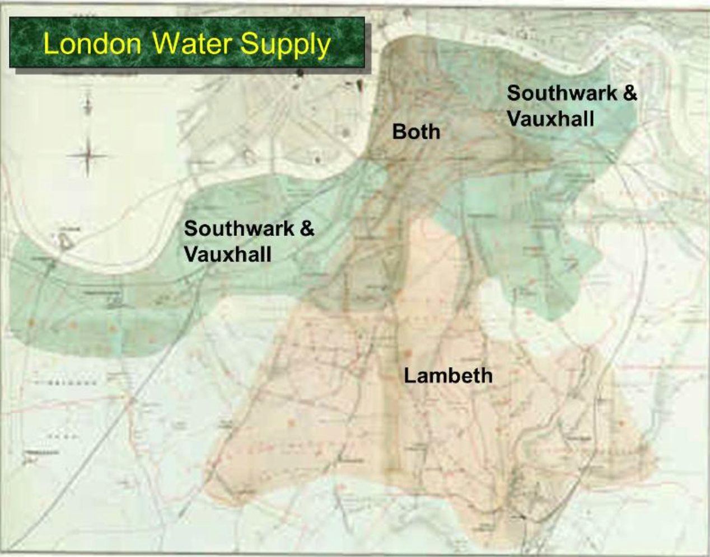

# 2 Causality and Experiment

## 2.1 Observation and Visualization: John Snow and Broad Steet pump

- Snow’s map is one of the earliest and most powerful uses of data visualization. Disease maps of various kinds are now a standard tool for tracking epidemics.
- Use **comparison** to identify an association between a treatment and an outcome.

---

## 2.2 Snow's "Grand Experiment"

- Lodon Water Supply

    

- Summarized data

  | Supply Area    | Number of houses | cholera deaths | deaths per 10,000 houses |
  | -------------- | ---------------- | -------------- | ------------------------ |
  | S&V            | 40,046           | 1,263          | 315                      |
  | Lambeth        | 26,107           | 98             | 37                       |
  | Rest of London | 256,423          | 1,422          | 59                       |

---

## 2.3 Establishing Causality

1. - 将 people in the S&V houses 作为 **treatment group**
    - 将 those in the Lambeth houses 作为 **control group** (对照组)
2. 必须比较两组除了供水之外其他方面是否相同
3. Def. 在两组之间，除了 treatment 之外的差异称为 **confounding factor**.

---

## 2.4 Randomization

1. Def. 若将个体 (individuals) 随机分配到 treatment and control groups，则这是在润一个 **randomized controlled expriment** a.k.a **randomized controlled trial** (RCT).
2. Def. **blind** experiment, in which individuals do not know whether they are in the treatment group or the control group. 
3. 在 blind experiments 中，考虑给 control group 使用 **placebo** (安慰剂)，使其看起来和 treatment group 一模一样。

